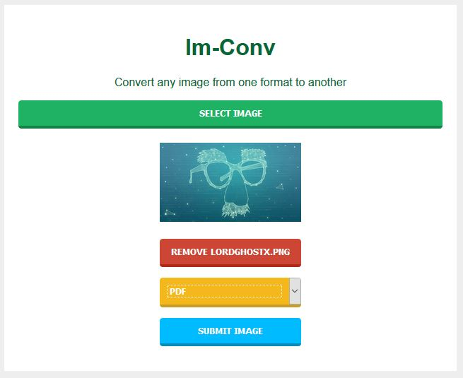
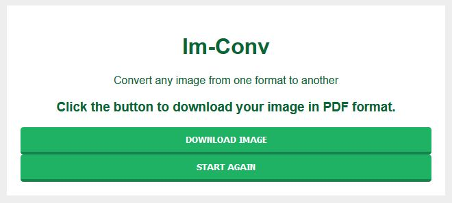

# Im-Conv

Convert any image from one format to another

Django Web Application that allows you to convert any image to another format. Currently supporting PNG, BMP, EPS, GIF, ICO, IM, JPEG, PCX, PPM, SGI, SPI, TIFF, WebP, PDF formats.

Coming Support for ICNS, MSP, XBM, PALM

Install requirements then...
```python
python manage.py runserver
```




